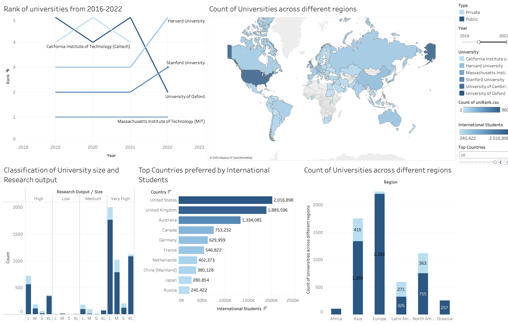

# EDA of QS World University Rankings

## Overview
Each year, Quacquarelli Symonds publishes a list of the best universities in the world (QS). 
## Description
The rankings were created in response to the increased demand for subject-level comparisons and are intended to assist prospective students in locating the top universities worldwide in their chosen profession. Along with the Times Higher Education World University Rankings and Academic Rating of World Universities, the QS ranking is acknowledged by the International Ranking Expert Group (IREG) as one of the most widely read university rankings in the world.

## [Dashboard](https://public.tableau.com/app/profile/aakansha.goyal/viz/QSWorldUniversityRankingsDashboard_16734715127030/Dashboard1?publish=yes)

### [Data Source](https://www.kaggle.com/datasets/padhmam/qs-world-university-rankings-2017-2022)
